# The On-Device Automation Harness

*An architecture walk-through of Cromite's `headless-automation-mode`*

---

## Preface

Most browser automation lives *outside* the browser: a desktop script speaks WebDriver
over a socket and puppets the app from across the room. This feature does the opposite.
It moves the puppeteer **inside** Cromite, onto the screen itself, as a small web app that
rides on top of whatever page you are visiting.

The design rests on a single sentence you should keep in mind for the rest of this book:

> **The page is the canvas, JavaScript is the brain, and native Android is the hands.**

- The **canvas** is an HTML page (`harness.html`) shown in a `WebView` laid over the tab.
- The **brain** is the JavaScript in that page: it owns the flows, the run loop, and the
  add/remove/update of flows. Nothing about *what to automate* lives in compiled code.
- The **hands** are native Android primitives that locate elements and then deliver *real*
  taps and keystrokes — `MotionEvent`s and `KeyEvent`s through the ordinary input pipeline,
  with randomized timing and a little coordinate jitter, so the renderer sees `isTrusted`
  events indistinguishable from a human's.

A note on intent and scope: the "human-like" behaviour here is ordinary
automation-quality pacing for **personal use** — typing that isn't robotically uniform,
taps that aren't pixel-perfect. It is not, and is not meant to be, a tool for defeating a
particular site's bot defences or solving CAPTCHAs.

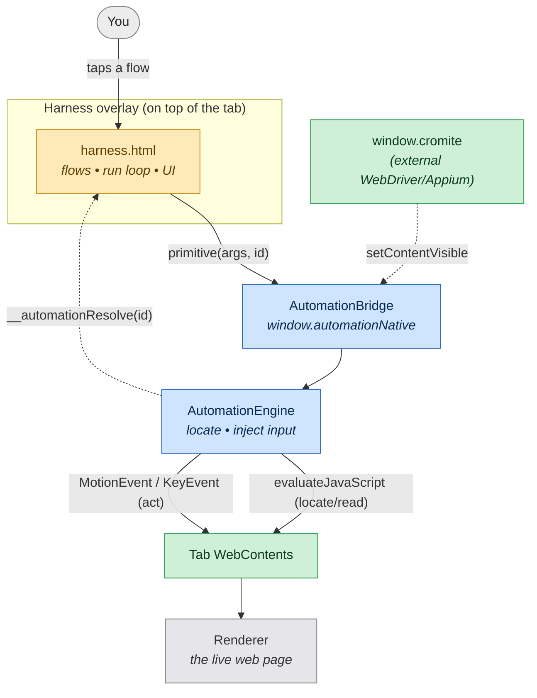

**Takeaway:** every arrow that *reads* the page is JavaScript; every arrow that *acts on*
the page is a real Android input event. Hold that distinction and the rest follows.

---

## Chapter 1 · The Cast of Files

The feature is a single Cromite patch, `Add-headless-automation-mode.patch`, but it touches
four worlds: a bundled web asset, three Java classes, a slice of the C++ mojo bridge, and the
flag plumbing. Here is who does what.

| File | World | Responsibility |
|---|---|---|
| `chrome/android/java/assets/cromite_automation/harness.html` | JS asset | The harness UI and **all** flow logic: registry, run loop, CRUD, two tabs. |
| `…/headless/CromiteHeadlessBridge.java` | Java | Builds the overlay (`FrameLayout` + `WebView`), attaches it to the tab, toggles visibility. |
| `…/headless/AutomationBridge.java` | Java | The `window.automationNative` surface; marshals JS calls to the UI thread, returns results. |
| `…/headless/AutomationEngine.java` | Java | Implements primitives: locate via JS, then inject real input. |
| `chrome/common/cromite_private_api_extension.mojom` | C++ IDL | Adds `SetContentVisible` / `IsContentVisible` to the existing private API. |
| `chrome/renderer/cromite/cromite_private_api_extension.{cc,h}` | C++ renderer | Exposes those as `window.cromite.*` (external control path). |
| `chrome/browser/cromite/cromite_private_api_host.{cc,h}` | C++ browser | Routes the mojo calls to the Java bridge via JNI. |
| `…/flags/cromite/sHeadlessAutomationMode.java` + `Headless-automation-mode.inc` ×3 | Flag | Defines the `headless-automation-mode` gate. |
| `chrome/android/java/res/xml/developer_preferences.xml` | Settings | The Developer-options switch that turns it on. |

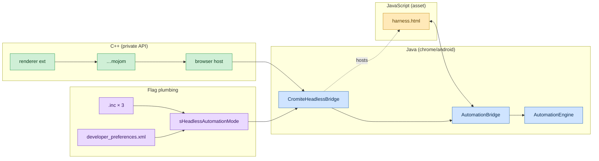

**Takeaway:** the JavaScript talks to exactly one Java object (`AutomationBridge`); the C++
mojo path is a *second*, optional door to the same overlay. The flag plumbing is orthogonal
— it only decides whether any of this is active.

---

## Chapter 2 · Foundation — How a Cromite Flag Comes to Life

Before the harness can exist, a switch must turn it on. Cromite doesn't edit Chromium's giant
`content_features.cc` directly; it drops small `.inc` fragments that the build aggregates. Our
feature, `headless-automation-mode`, is three such fragments plus a Java mirror and a settings
toggle.

The journey of one flag:

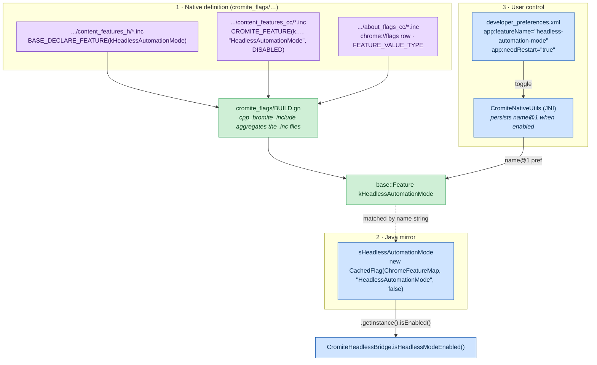

The string `"HeadlessAutomationMode"` is the glue: it is the `base::Feature` name in C++ **and**
the key the Java `CachedFlag` looks up through `ChromeFeatureMap`. When you flip the Developer-
options switch, `ChromeBaseSettingsFragment` reads `app:featureName`, calls `CromiteNativeUtils`,
and the native side records `headless-automation-mode@1` in flag storage when enabled (and clears
it when disabled). Because the value is *cached* at startup, the toggle is marked
`needRestart="true"`.

**Takeaway:** the harness is dormant until this flag is on; everything downstream reads it through
`sHeadlessAutomationMode.getInstance().isEnabled()`.

---

## Chapter 3 · Foundation — The `window.cromite` Bridge It Extends

The harness did not invent its native bridge. Cromite already ships a **test-support private API**
called `window.cromite`, used by WebDriver/Appium. It is a mojo interface,
`chrome::mojom::CromitePrivateApiExtension`, and the harness simply adds two methods to it:
`SetContentVisible` and `IsContentVisible`.

Two properties of this pre-existing API matter:

1. **It is locked down.** The renderer only injects `window.cromite` when
   `ShouldExposeCromitePrivateApi` is true — that means the `enable-cromite-test-support` feature
   is on **and** the document's origin is exactly `chrome://version`. Ordinary web pages never see it.
2. **It already solved async.** Methods that return a value hand JavaScript a `Promise`, parked in a
   `PendingRequest` map keyed by a `base::UnguessableToken`, and resolved when the browser replies.
   (The harness reuses this exact shape for `IsContentVisible`.)

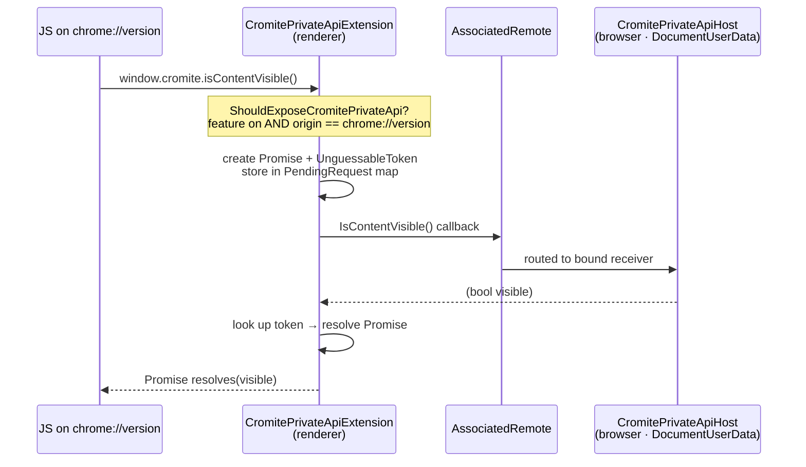

The browser host (`CromitePrivateApiHost`) is a `DocumentUserData` bound through the associated-
interface registry (`BindHost`), so it lives and dies with the frame.

Separately, test-support also reroutes the **DevTools socket**: when `sActAsWebView` is enabled,
`ProcessInitializationHandler` gives the `DevToolsServer` a `weblayer` prefix so Appium can attach.

**Takeaway:** the harness's external control path is a thin extension of an existing, origin-gated,
Promise-capable bridge — not new machinery.

---

## Chapter 4 · Foundation — Where a Page Lives on Android

To lay a UI *over* the page, you need the Android view that *is* the page. On Android, a tab's
`WebContents` exposes a `ViewAndroidDelegate`, and its `getContainerView()` returns the container
`ViewGroup`. In Chrome that container is a `CompositorViewHolder`, which **extends `FrameLayout`** —
a happy fact, because a `FrameLayout` stacks its children, so an overlay added last sits on top
while the compositor surface keeps rendering underneath.

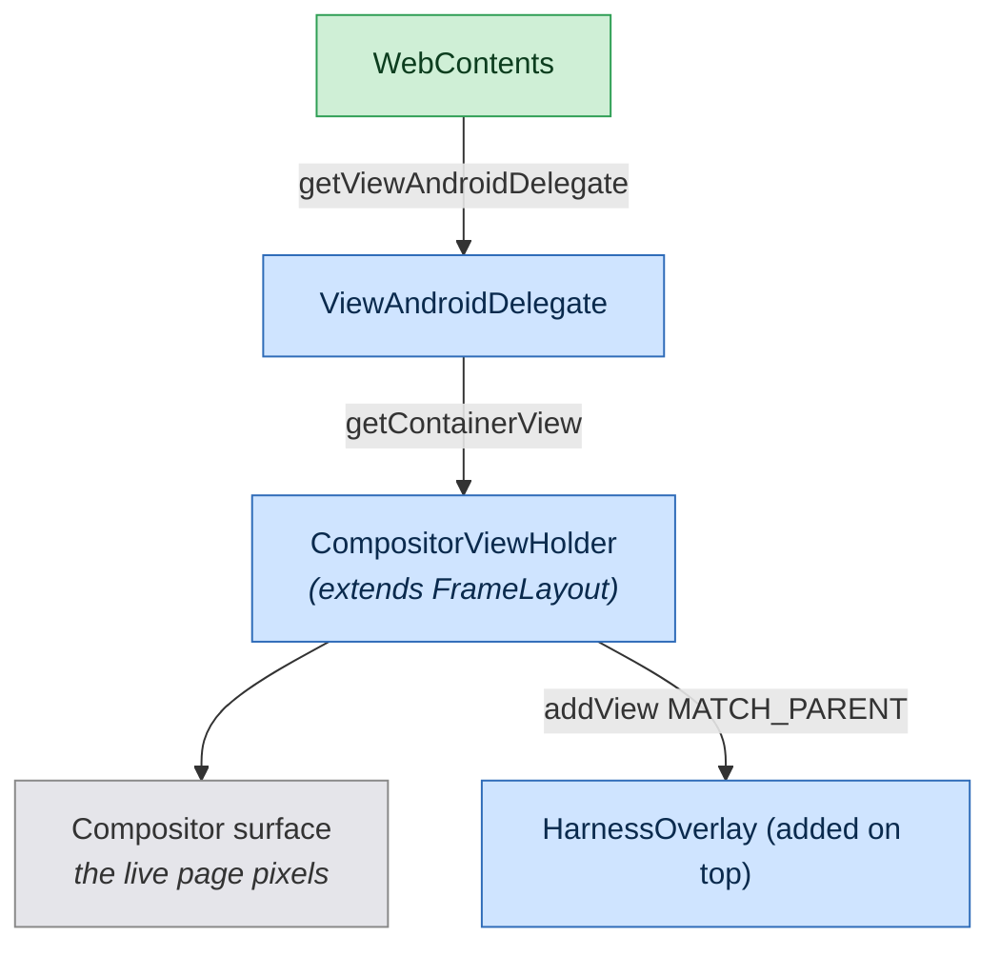

From this same `WebContents` the engine borrows three faculties:

- **Read the DOM** — `evaluateJavaScript(String, JavaScriptCallback)`, whose
  `handleJavaScriptResult(String json)` delivers the answer.
- **Navigate** — `getNavigationController().loadUrl(new LoadUrlParams(url))`.
- **Act like a finger/keyboard** — dispatch `MotionEvent` / `KeyEvent` to the container view
  (trusted input), turning characters into keystrokes with
  `KeyCharacterMap.load(VIRTUAL_KEYBOARD)`. (An `EventForwarder` path exists as a version-specific
  alternative; see the appendix.)

**Takeaway:** because the container is a `FrameLayout`, "hiding the page" is just toggling an
overlay child's visibility — the renderer never stops.

---

## Chapter 5 · The Object Model

With the foundations in place, here is the harness proper. Three Java classes and three JavaScript
singletons, related as follows.

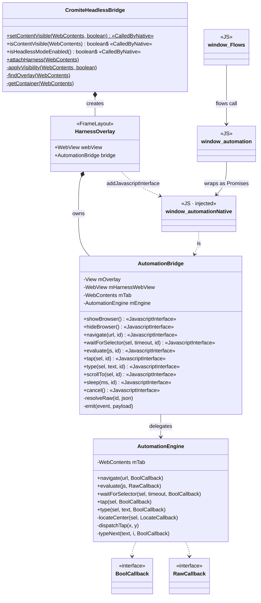

**Takeaway:** `AutomationBridge` is the *seam*. On its JavaScript face it is
`window.automationNative`; on its Java face it delegates the real work to `AutomationEngine`.

---

## Chapter 6 · A Tap, End to End

Nothing illuminates an architecture like following one request all the way down and back. Let's
trace `automation.tap("#login")`.

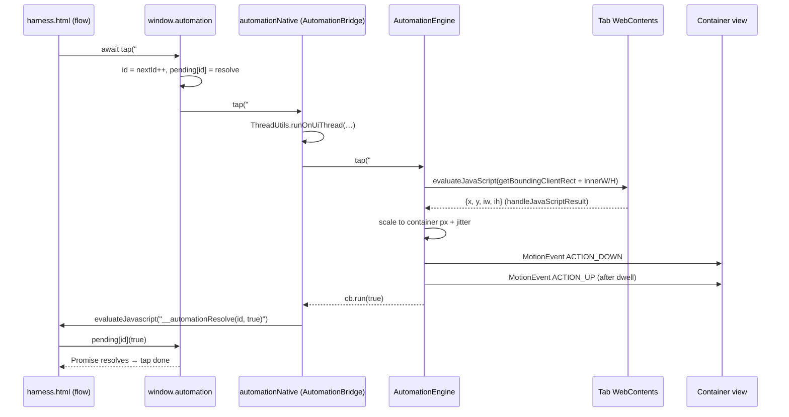

Two details are worth dwelling on. First, the **locate/act split**: JavaScript only computes
*where* the element is (`getBoundingClientRect`); the click itself is a real `MotionEvent` at that
spot, so the renderer records a trusted tap. Second, the **thread hop**: `@JavascriptInterface`
methods arrive on a WebView binder thread, so the bridge immediately bounces to the UI thread
before touching views or `WebContents`.

**Takeaway:** a primitive is a round trip — JS asks, native acts, native calls back into JS by id.

---

## Chapter 7 · Typing Like a Human

Typing is the same locate/act split, stretched over time. The engine first focuses the field via
JavaScript, then emits one character at a time as real key events, pausing between them.

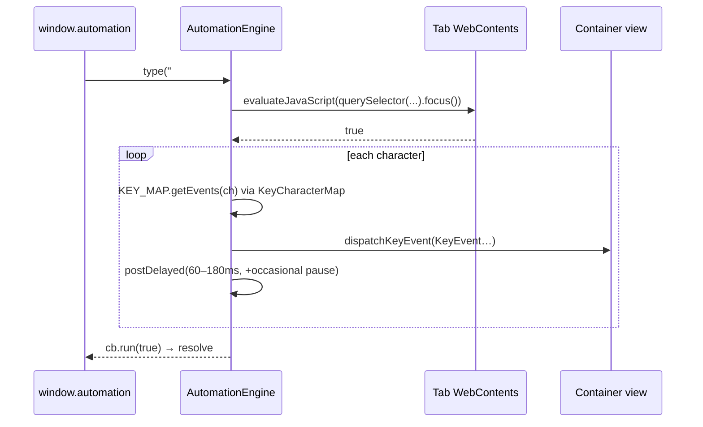

The randomized cadence (a 60–180 ms base with the occasional longer pause) is the whole point:
the keystrokes are `isTrusted` and arrive with human-shaped timing rather than in a single
instantaneous burst.

**Takeaway:** "human-like" is implemented as *real events + irregular delays*, not as faked DOM
events.

---

## Chapter 8 · The Correlation Trick

You may have noticed every primitive carries a trailing `id`. That integer is how an inherently
one-way channel (`@JavascriptInterface` methods return `void`; results come back via
`evaluateJavascript`) is turned into request/response.

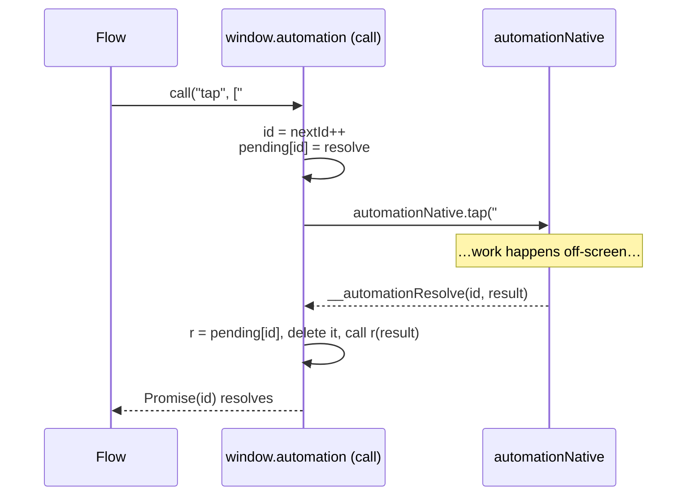

It is deliberately humble: a monotonically increasing counter, a `pending{}` map, and one global
function `window.__automationResolve(id, value)` that the native side calls. The same pattern is a
miniature of the C++ side's `UnguessableToken` map from Chapter 3 — though here, inside a single
trusted page, a plain counter suffices.

**Takeaway:** the `id` is the request ticket; `__automationResolve` is the counter that calls your
number.

---

## Chapter 9 · Two Faces — Harness vs. Browser

The overlay is opaque, so at any instant the user is looking at **either** the harness **or** the
live page. Switching between them is just the overlay's visibility.

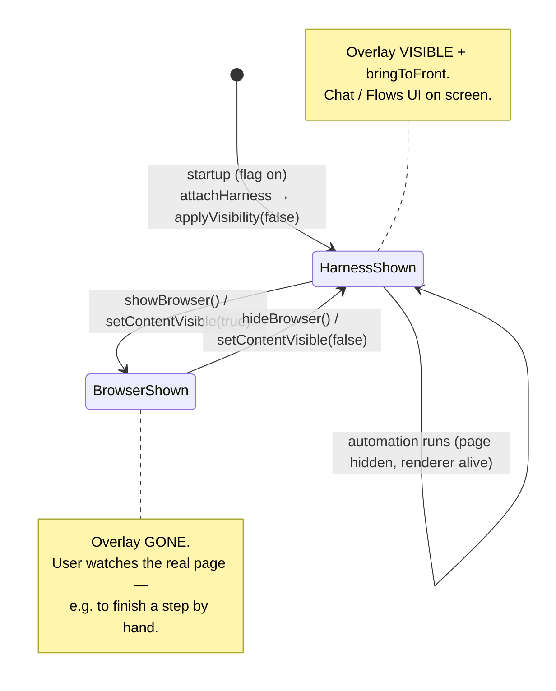

Both faces are reachable two ways: from the page itself (`window.automation.showBrowser()` — the
harness's "Show browser" button) and from outside (`window.cromite.setContentVisible(true)` over
DevTools). They converge on the same `applyVisibility` method.

**Takeaway:** there is exactly one piece of visibility state — the overlay's `VISIBLE`/`GONE` —
and several buttons that flip it.

---

## Chapter 10 · Birth of the Overlay

How does the harness get on screen in the first place? When the flag is on, the tab-init path calls
`CromiteHeadlessBridge.attachHarness(webContents)`. (Wiring this call into the active-tab/activity
init is one of the build-environment integration points — see the appendix.)

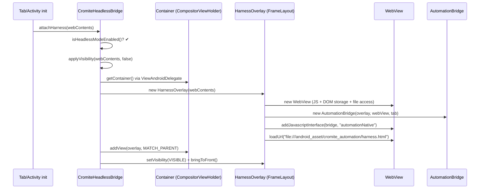

**Takeaway:** attachment is idempotent and lazy — `findOverlay` ensures one overlay per
`WebContents`, created the first time the page is hidden.

---

## Chapter 11 · The External Door

For completeness: the C++ `window.cromite` methods added in Chapter 3 exist so an *external*
controller (WebDriver/Appium on a desktop) can drive the same show/hide as the in-page buttons.
This chapter just shows the new tail of that journey, where C++ reaches Java.

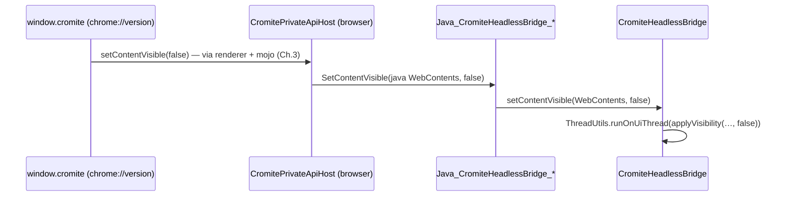

**Takeaway:** the external door and the in-page buttons are two entrances to one room —
`applyVisibility`.

---

## Chapter 12 · Flows Live in JavaScript

Finally, the brain. Everything about *what to automate* is JavaScript inside `harness.html`; no
native change is needed to add or edit a flow. A flow is just an object with an async `run(a)` that
calls the `window.automation` primitives.

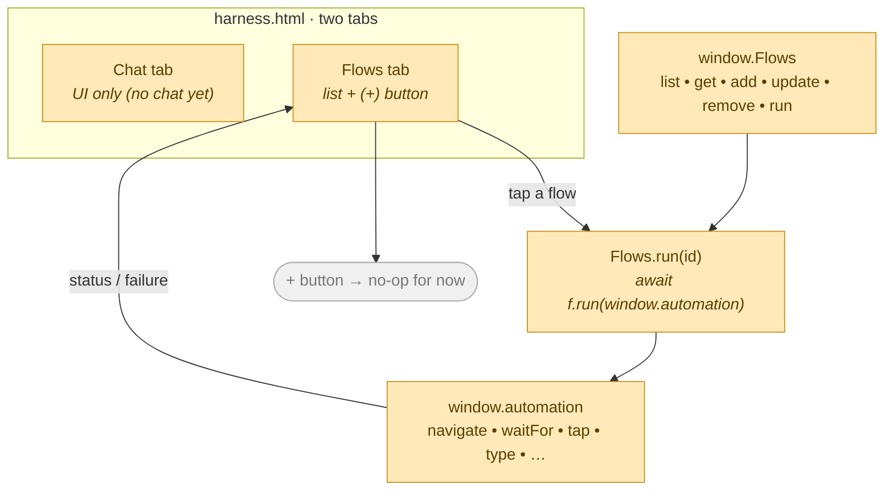

The **Chat** tab is intentionally inert UI (no real chatting yet). The **Flows** tab lists whatever
`window.Flows` holds; tapping one runs it, and the engine's `onStatus`/`onProgress`/`onFailure`
events feed the status line and the "do it manually" prompt. The **(+)** button is a deliberate
placeholder — flow *creation through the harness* isn't designed yet, so it does nothing but say so.

**Takeaway:** to ship a new automation you write a JS object and `window.Flows.add(...)` it; the
native layer never changes.

---

## Appendix A · Primitive Reference

| `window.automation` | Native (`automationNative`) | Engine action |
|---|---|---|
| `navigate(url)` | `navigate(url, id)` | `getNavigationController().loadUrl(LoadUrlParams)` |
| `waitFor(sel, timeout)` | `waitForSelector(sel, timeout, id)` | poll `querySelector` via `evaluateJavaScript` |
| `evaluate(js)` | `evaluate(js, id)` | `evaluateJavaScript(js, JavaScriptCallback)` |
| `tap(sel)` | `tap(sel, id)` | `locateCenter` → `dispatchTap` (`MotionEvent` down/up + jitter) |
| `type(sel, text)` | `type(sel, text, id)` | focus via JS → `typeNext` (`KeyEvent` per char + delay) |
| `scrollTo(sel)` | `scrollTo(sel, id)` | `element.scrollIntoView` via JS |
| `sleep(ms)` | `sleep(ms, id)` | `WebView.postDelayed` |
| `showBrowser()` / `hideBrowser()` | same | overlay `setVisibility(GONE / VISIBLE)` |
| `cancel()` | `cancel()` | stop pending posts, clear handler |

Engine → harness events: `onStatus({text})`, `onProgress({step,total})`, `onFailure({message})`,
delivered by `AutomationBridge.emit(...)` → `window.automation.<event>(...)`.

## Appendix B · Threading Model

- `@JavascriptInterface` methods run on a **WebView binder thread**. `AutomationBridge` immediately
  marshals to the **UI thread** with `ThreadUtils.runOnUiThread` before touching any `View` or
  `WebContents`.
- Results return to JavaScript on the UI thread via `WebView.evaluateJavascript(...)`.
- Per-character typing and the tap's up-event use `Handler.postDelayed` on the main looper, so the
  UI thread is never blocked while "waiting like a human".

## Appendix C · Build-Environment Integration Checklist

These are intentionally **not** in the patch diff (they are Chromium-version/tree specific, mirroring
the patch's existing `generate_jni` note):

1. **`generate_jni`** — register `CromiteHeadlessBridge`, `AutomationBridge`, `AutomationEngine` so
   `CromiteHeadlessBridge_jni.h` is generated for `chrome/browser`.
2. **`android_assets()`** — bundle `harness.html` to
   `assets/cromite_automation/harness.html` (mirror `Experimental-user-scripts-support.patch`).
3. **Startup call site** — invoke `CromiteHeadlessBridge.attachHarness(tab.getWebContents())` at
   active-tab/activity init, re-asserting on active-tab change so a new tab can't leak content.
4. **Input dispatch** — confirm container `dispatchTouchEvent`/`dispatchKeyEvent` versus
   `WebContents.getEventForwarder()` for the targeted Chromium version.

---

*This document is hand-maintained. The patch itself is `build/patches/Add-headless-automation-mode.patch`;
the auto-generated catalogue entry lives in `docs/PATCHES.md`.*
